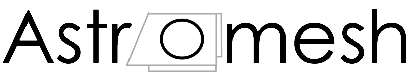

### Purpose and Overview

Astromesh was imagined to be a "glue" solution for builders of Astromech and
similar droids. As a builder I noted that each control or interface solution sat
on an island with no universal set of tools or protocols to bind them. It was
also intended to create a more modern control stack vs the typical use of RC
controllers  with secondary controllers for items like lights and sounds. The hope is to help evolution of user interface and controller options by defining a standardized controller <-> droid API. 

The project has a secondary goal to provide software-only solutions wherever possible. It would be ideal to be able to build an entire command and control stack purely out of "off the shelf" components. While customized hardware offers some great advantages it is somtimes difficult to obtain or challenging to contruct. Astromesh will attempt to define a standardized platform that could be constructed from commodity parts. 

###### Summarized project objectives:

* Provide a performant, bi-directional, event-driven central control server. 
* The stack should be able to be run on a range of hardware from very small and cheap to very powerful. 
* Define a standardized control API to allow interface developers freedom of expression without having to create the entire "stack".
* Provide a simple, usable control interface for Android and/or iOS devices. 
* Provide a simple droid simulation view. 
* Provide a web-based droid configuration tool used to define what controls and systems the droid has. 
* Implement necessary safeguards for use in "the real world". Can't have a droid running off into a crowd of fans. 
* Define a standardized "driver" protocol for future expandability (eg: different lighting systems could be controlled by a standardized set of commands.) 
* Provide a protocol for droid "self-description". This will allow controllers to query a droid for its supported devices, systems and sounds. 

### Current Project Status
2013-08: Project intiated. Overview documentation created. Controller API mostly defined. Stubs of some controller functions added. 

### Technologies

###### Software Framework
Astromesh is build around Node.js and websockets (via Socket.io). Node is an exceptionally fast event-driven framework ideally suited to the high-concurrency required in robotics control scenarios. Socket.io is a very capable and mature HTML WebSockets implementation. These technologies together create an extremely fast and extremely extensible framework. 

While there are other robotics control platforms available I didn't want this project to require them. They tend to evolve quickly and drastically and I felt it better for Astromesh to have a bit more control over its own evolutionary path. Also, Node.js is becomming a very well-adopted system that can be deployed on a wide range of hardware (with more added all the time). This gives builders a lot of flexibility in component selection. 

For future expansion and broader capabilities (like autonomous control) I expect it will not be difficult to bridge Astromesh with more extensive robotics frameworks. 

###### Server Hardware
While Astromesh could be deployed using anything that could run Node I expect most will use small, inexpensive devices like Raspberry Pi's or Beaglebone's (though nothing about Astromesh requires these.)

###### Controller Hardware
Most server hardware components will not be able to directly control the myriad devices in a typical Astromech so some secondary controller hardware will be required. Core Astromesh development will focus on Arduino-based or "raw" I2C servo controllers. 

###### I2C
While it will ultimately be up to the "drivers" to determine how communication flows from the server to the controller hardware (or sensors) it is assumed that the primary protocol will be I2C for its light weight and extensive adoption. 

### Device List
One of the objectives of the project is to standardize or codify a typical set of Astromech devices and control points. 

Currently:

- Drive System (L/R motors)
- 2-3-2 Servos (quantify)
- Dome Rotation
- Holoprojectors (motion)
     - HP1
     - HP2
     - HP3
- Pie Panels
     * PP1
     * PP2
     * PP3
     * PP4
     * PP5
- Dome Top
- Side Panels
     * SP1
     * SP2
     * SP3
     * SP4
     * SP5
     * SP6 
- Display Systems Lights
     - Teeces Controller
     - JEDI Controller
     - Magic Panel
- Sound Player
- Periscope
- LFS
- Sensors/Telemetry
     - Temperature
     - GPS
     - Battery Levels
     - Runtime
     - Video stream 
     - etc

### Control Protocol Event Types

This it the list of standardized Astromesh events that the server and controllers will understand. 

* Controller Commands
     - getConfig
     - drive
     - rotateDome
     - changeDisplay
          * displayID (RLD, FLD1, FLD2 etc)
          * displayMode
     - playSound
     - changeLegMode
     - moveHP
     - changePanel
     - changeLFS
     - changePeriscope
     - customCommand
          * [a placeholder for custom commands not defined in the spec]

* Droid Events
     - configuration
          * [description of available droid-ware]
     - status
          * batteryLevels
          * gpsLocation
          * runtime
          * temp

### Control Protocol Specifications - Commands

##### getConfig

     { value:null }
Initiates a request to get the current droid control configuration. Droid will return a “configuration” event. There is no data value. 

##### drive
Drives the droid via the left and right foot motors.

     {
          “direction”:int,
           “velocity”: int
     }

Direction and Velocity are each values between -100 and +100. These values will be translated by the droid into Left/Right foot motor pulse values. 

##### rotateDome
Rotates the dome. Value of -100 to +100 will change direction and speed. 

     {
          “value”:int
     }

##### changeDisplay
Changes various display modes on the droid. 

     {
          “display”:displayName,
          “mode”: modename,
          “displayText”: text
     }

displayName = “fld1”,”fld2”,”rld” or “all” etc. 
modeName = “random” or some other pre-defined name. 
displayText = Text to display if mode supports it. 

##### playSound
Plays a sound on the droid. 

     {
          “name”:fileName

     }

name: the name of the sound file (ex: R2BEEP1.mp3)

##### changeLegMode

Changes the leg orientation of the droid for those that support a 2-3-2 configuration. 

     {
          “mode”:modeName
     }

modeName = “2leg” or “3leg”

##### moveHP (TBD)

##### changePanels
Changes open/closed state of dome panels. 

     {
          “pp1”:panelState,
          “pp4”: panelState
     }

panelState = int of 0 to 100 that indicates full closed or full open. 

##### changeLFS (TBD)

##### changePeriscope (TBD)

##### customCommand
Available to send custom commands for any unimplemented events. Expansion for droidbuilder to use. 

     {
          ‘data’:customData
     }

